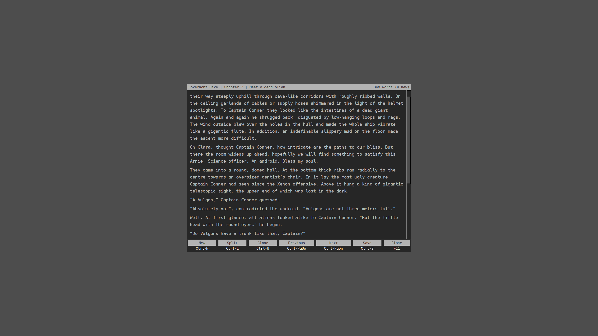
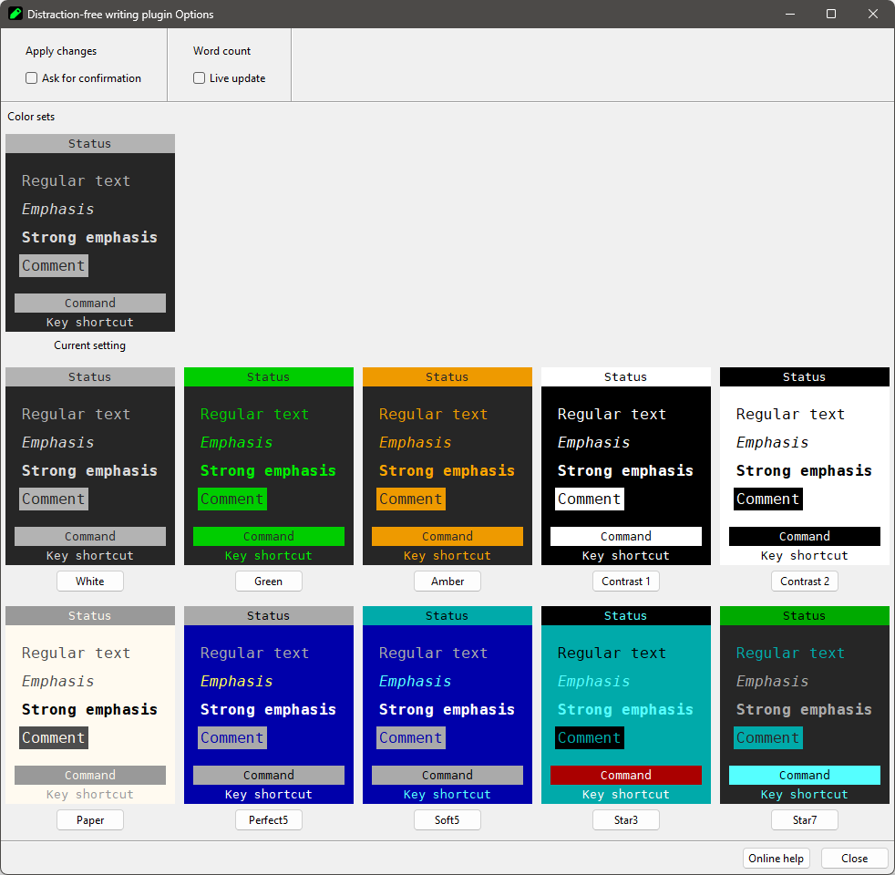
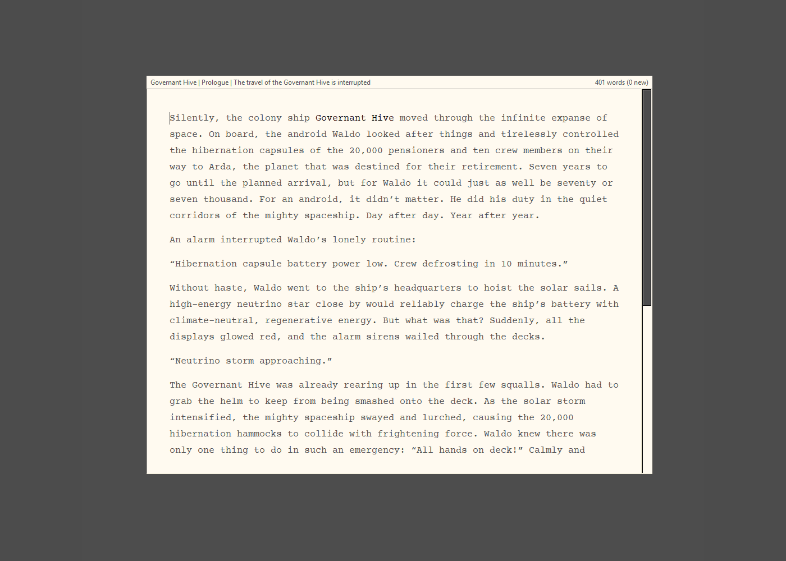

# nv_writer

The [novelibre](https://github.com/peter88213/novelibre/) Python program helps authors organize novels.  

*nv_writer* is a "distraction free editor" plugin for novelibre. 
Just press `Ctrl`-`W`, and the editor window opens instantly with the selected section loaded. 
Change the sections via `Ctrl`-`PgUp` and `Ctrl`-`PgDn`, or create new sections with `Ctrl`-`N`. 
Although mouse operations are possible, the editor can be operated entirely via the keyboard. 

With the menu displayed, it resembles a DOS word processor.:

You can choose a color scheme according to your taste: 

Hiding the menu might give you a typewriter feel:

## Features

- Full screen mode with an editor window that resembles a 12" monochrome monitor as used with the early PCs.
- A simple, mainly keyboard-operated text editor box without spell checker and search capability.
- A basic function menu can be folded in at the bottom via `Ctrl`-`F1`.
- Online help can be called up via `F1`.
- Text is displayed like plain text; emphasized and strongly emphasized text is highlighted in an unobtrusive way.
- The word count is displayed for the currently loaded section. Both the total word count and the change made during the current session are shown. 
- The application is ready for internationalization with GNU gettext. A German localization is provided. 
- Editor features:
    - Text selection.
    - Copy/Cut/Paste to/from the clipboard.
    - Undo/Redo.
    - Create a new section after the current one.
    - Split the section at the cursor position.
    - Switch to the next or previous section.

> [!CAUTION]
> This is an experimental Beta release. 
> Please check the results with *OpenOffice/LibreOffice Writer*, and report any issues if something seems strange. 
> Feel free to share your thoughts in the [novelibre discussion forum](https://github.com/peter88213/novelibre/discussions). 
>
> See #5 to find out what is not working yet. 

## Requirements

- [novelibre](https://github.com/peter88213/novelibre/) version 5.52+

## Download and install

### Default: Executable Python zip archive

Download the latest release [nv_writer_v0.11.0.pyz](https://github.com/peter88213/nv_writer/raw/main/dist/nv_writer_v0.11.0.pyz)

- Launch *nv_writer_v0.11.0.pyz* by double-clicking (Windows desktop),
- or execute `python nv_writer_v0.11.0.pyz` (Windows), resp. `python3 nv_writer_v0.11.0.pyz` (Linux) on the command line.

> [!IMPORTANT]
> Many web browsers recognize the download as an executable file and offer to open it immediately. 
> This starts the installation under Windows.
> 
> However, depending on your security settings, your browser may 
> initially  refuse  to download the executable file. 
> In this case, your confirmation or an additional action is required. 
> If this is not possible, you have the option of downloading 
> the zip file. 

### Alternative: Zip file

The package is also available in zip format: [nv_writer_v0.11.0.zip](https://github.com/peter88213/nv_writer/raw/main/dist/nv_writer_v0.11.0.zip)

- Extract the *nv_writer_v0.11.0* folder from the downloaded zipfile "nv_writer_v0.11.0.zip".
- Move into this new folder and launch *setup.py* by double-clicking (Windows/Linux desktop), 
- or execute `python setup.py` (Windows), resp. `python3 setup.py` (Linux) on the command line.

---

[Changelog](docs/changelog.md)

## Usage

See the [instructions for use](https://peter88213.github.io/nv_writer/help/)

---

## License

This is Open Source software, and the *nv_writer* plugin is licensed under GPLv3. See the
[GNU General Public License website](https://www.gnu.org/licenses/gpl-3.0.en.html) for more
details, or consult the [LICENSE](https://github.com/peter88213/nv_writer/blob/main/LICENSE) file.
